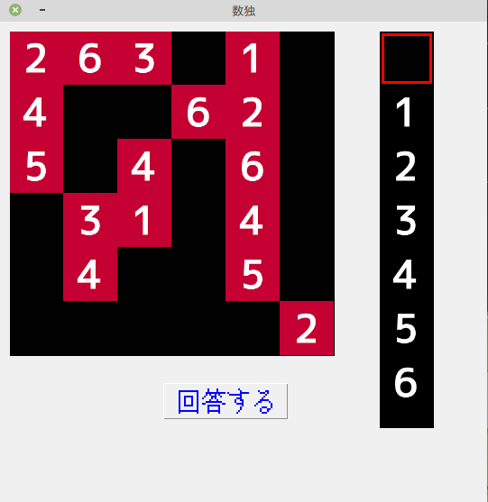
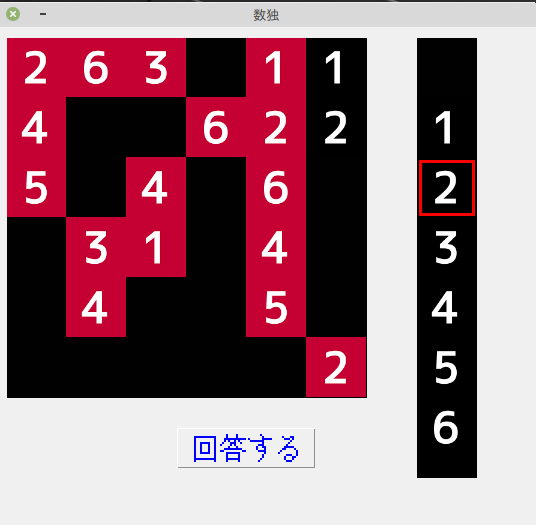
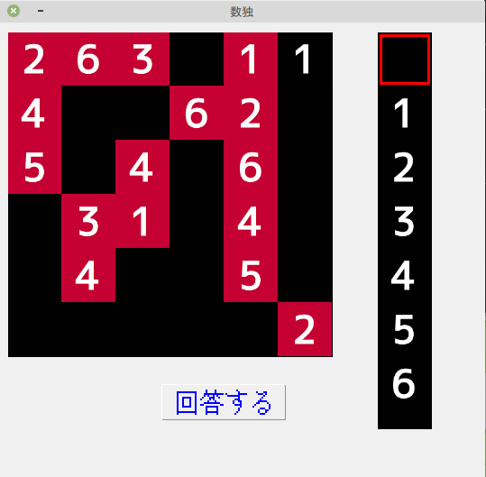
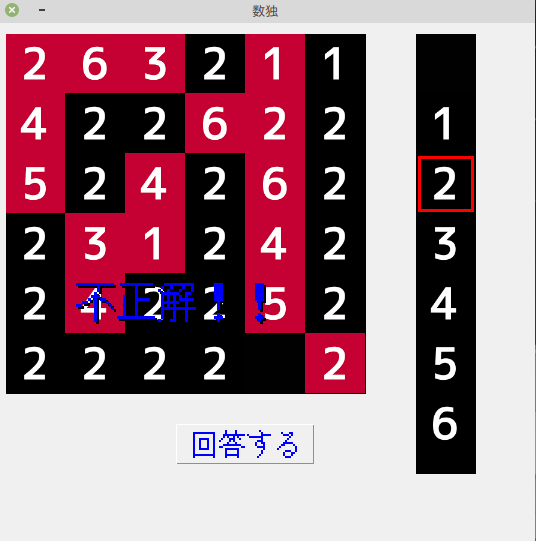
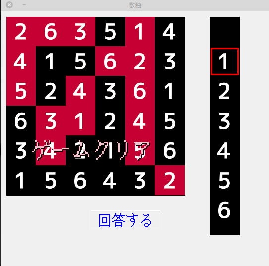

# 数独ゲーム

6x6の数独ゲームの作成を行いました。右側の数字をマウスでクリックし(赤色の枠が出てくる)、入れたい数字をゲームメニューにマウスクリックすることで数字が入力されます。

python startGame.pyで起動します。起動した画面は以下の画像です。

下の画像は右側の数字の羅列の２という数字をクリップしており、その状態で入れたい場所をマウスでクリックすることで数字が挿入されます。

入力された数字を消したい場合は一番上の黒色をクリップし、消したい数字をマウスでクリックすることで数字が消えます。

回答するボタンを押すことで正解を確認することができ不正解なら以下の画面が出力されます。

正解なら以下の画面が出力されます。

# 追加したい機能

問題のバリエーションを増やす
